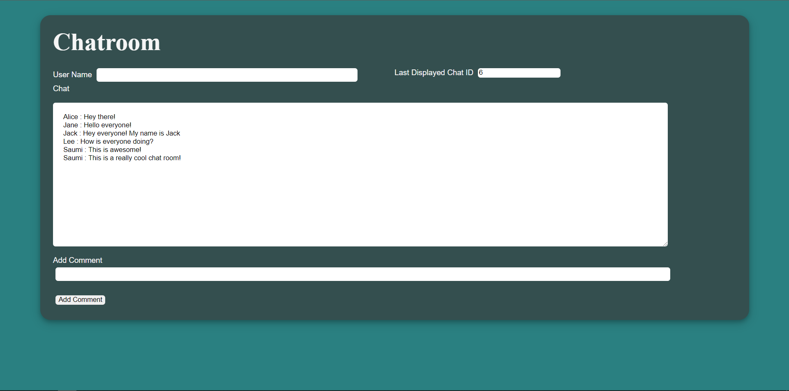

# Ajax-based Chat Room

This is a multi-user chat room where user can comment a message to the chat board which is visible to all the user. Each comments of the user is stored in a MySQL database and is updated in realtime using Ajax GET method. The request uses jQuery formatting and runs on Apache server.

How to use:

1. Install XAMPP on your local machine
2. Download this repo into directory: C:/xampp/htdocs
3. On the XAMPP dashboard, start Apache and MySQL
4. On the web browser type in- http://localhost/Chat-Room/client.html